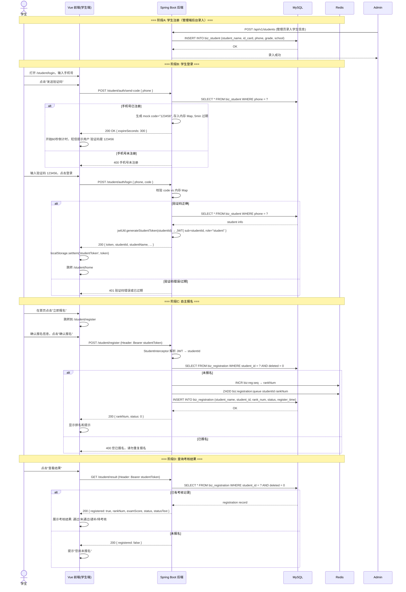

# 学生报名门户 — 系统架构设计文档

> 设计人：高见远（Gao），资深系统架构师  
> 基准代码库：`D:\code\auto-project`  
> 目标：在现有 Auto Project 管理系统上扩展学生端门户，支持学生自助注册、验证码登录、自主报名、查看考核结果

---

## 1. 实现方案 — 架构变更全貌

### 1.1 整体架构

```
┌─────────────────────────────────────────────────────────────┐
│                     Vue 3 + Element Plus                     │
│                                                             │
│   /login          /admin/*              /student/*          │
│   管理端登录       管理端页面 (Layout)     学生端页面 (StudentLayout) │
│   (LoginPage)     │ 侧边栏+RABC菜单         │ 无侧边栏/底部导航      │
│                   │ Pinia token            │ Pinia studentToken │
│                   │ localStorage token      │ localStorage studentToken │
└──────┬───────────────┬────────────────────────┬──────────────┘
       │               │                        │
       ▼               ▼                        ▼
┌─────────────────────────────────────────────────────────────┐
│                    Spring Boot 3 (Virtual Threads)           │
│                                                             │
│  AuthController   AdminControllers     StudentControllers   │
│  /api/v1/auth/    /api/v1/users/       /api/v1/student/     │
│       │                │              (auth + profile +      │
│       ▼                ▼               register + result)    │
│  ┌──────────────────────────────────────┐        │          │
│  │           JwtUtil                    │        ▼          │
│  │  generateToken(userId, username)     │  ┌─────────────────┐
│  │  generateStudentToken(studentId)     │  │ 验证码 (Mock)    │
│  │  getRole(token)                      │  │ code = "123456" │
│  │  getUserId(token)                    │  └─────────────────┘
│  └──────────┬───────────────────────────┘                   │
│             ▼                                              │
│  ┌──────────────────────┐     ┌──────────────────┐        │
│  │  Admin JWT           │     │  Student JWT     │        │
│  │  sub=userId(管理员)   │     │  sub=studentId   │        │
│  │  username=xxx        │     │  role="student"  │        │
│  └──────────────────────┘     └──────────────────┘        │
│                                                             │
│  ┌──────────────────────────────────────────────────────┐  │
│  │              StudentInterceptor (JWT校验)              │  │
│  │  /api/v1/student/** → 校验 token role="student"       │  │
│  └──────────────────────────────────────────────────────┘  │
└────────────┬────────────────────────────────────────────────┘
             │
    ┌────────┴────────┐
    │   MySQL         │    Redis
    │  sys_* + biz_*  │    biz:registration:queue (报名队列)
    └─────────────────┘
```

### 1.2 关键架构决策

| 决策点 | 方案 | 依据 |
|--------|------|------|
| 前端路由 | `/admin/*`（管理端） + `/student/*`（学生端） | PRD 已确认：同 Vue 3 项目，不同路由 |
| 学生认证 | JWT payload: `sub=studentId, role="student"` | PRD 已确认：独立 JWT |
| 管理端认证 | 现有 JWT (`sub=userId, username=xxx`)，无需变化 | 向后兼容 |
| 验证码 | 一期 Mock：固定 `123456`，5分钟有效期（内存） | PRD 已确认 |
| 密码 | 学生端不设密码，仅验证码登录 | PRD 已确认 |
| 学生表 | 使用现有 `biz_student`，新增字段 | 复用已有基础设施 |
| JWT 校验 | 新增 `StudentInterceptor` 拦截 `/api/v1/student/**` | 与管理端隔离 |
| 前端状态 | 独立 Pinia Store (`student.ts`)，独立 localStorage key | 避免与管理端冲突 |

### 1.3 学生 Portal 页面树

```
/student                     → StudentLayout.vue (基础布局)
/student/login               → StudentLoginPage.vue (手机号+验证码登录)
/student/home                → StudentHomePage.vue (个人信息+报名入口)
/student/register             → StudentRegisterPage.vue (报名确认)
/student/result               → StudentResultPage.vue (考核结果)
```

---

## 2. 数据库变更（DDL）

### 2.1 biz_student 表 — 扩展字段

```sql
-- 新增字段：添加登录手机号唯一约束
ALTER TABLE biz_student
    ADD COLUMN phone VARCHAR(20) NOT NULL DEFAULT '' COMMENT '手机号（登录凭证）' AFTER id_card,
    ADD UNIQUE KEY uk_phone (phone);

-- 如果 phone 字段已存在但无唯一约束，改为：
-- ALTER TABLE biz_student ADD UNIQUE KEY uk_phone (phone);

-- 新增字段：学生端登录状态
ALTER TABLE biz_student
    ADD COLUMN student_status TINYINT DEFAULT 1 COMMENT '学生端状态: 0=禁用,1=启用' AFTER status;
```

### 2.2 验证码存储（可选 — Mock 阶段可用内存 Map，生产用 Redis）

```sql
-- Mock 阶段无需此表。若未来对接真实短信，创建：
CREATE TABLE IF NOT EXISTS biz_sms_code (
    id BIGINT AUTO_INCREMENT PRIMARY KEY,
    phone VARCHAR(20) NOT NULL COMMENT '手机号',
    code VARCHAR(6) NOT NULL COMMENT '验证码',
    type VARCHAR(20) DEFAULT 'LOGIN' COMMENT '类型: LOGIN/REGISTER',
    expire_time TIMESTAMP NOT NULL COMMENT '过期时间',
    used TINYINT DEFAULT 0 COMMENT '0=未使用,1=已使用',
    create_time TIMESTAMP DEFAULT CURRENT_TIMESTAMP,
    INDEX idx_phone_type (phone, type)
);
```

### 2.3 完整 DDL 汇总（增量迁移脚本）

```sql
-- migration_v2_student_portal.sql
-- Phase 1: Mock 验证码，仅变更 biz_student

-- 1. 确保手机号字段存在且唯一
ALTER TABLE biz_student 
    MODIFY COLUMN phone VARCHAR(20) NOT NULL COMMENT '手机号（登录凭证）';

ALTER TABLE biz_student 
    ADD UNIQUE KEY uk_phone (phone);

-- 2. 添加学生端独立状态控制
ALTER TABLE biz_student 
    ADD COLUMN student_status TINYINT DEFAULT 1 COMMENT '学生端状态: 0=禁用,1=启用';
```

---

## 3. 新增文件清单

### 3.1 后端新增文件

```
backend/src/main/java/com/example/autoproject/
├── controller/
│   └── StudentAuthController.java        # 学生认证: 发送验证码 + 登录
├── service/
│   ├── StudentService.java               # 学生服务接口
│   └── impl/
│       └── StudentServiceImpl.java       # 学生服务实现: 验证码校验、登录、查结果
├── dto/
│   ├── StudentSendCodeRequest.java       # 发送验证码请求
│   ├── StudentLoginRequest.java          # 学生登录请求 (phone + code)
│   ├── StudentRegisterRequest.java       # 学生自主报名请求
│   └── StudentResultVO.java              # 学生考核结果VO
├── vo/
│   └── StudentLoginVO.java              # 学生登录响应 (token + studentInfo)
└── interceptor/
    └── StudentAuthInterceptor.java       # 学生JWT拦截器
```

### 3.2 前端新增文件

```
frontend/src/
├── views/
│   ├── student/
│   │   ├── StudentLayout.vue            # 学生端框架布局 (顶部导航 + 内容区)
│   │   ├── StudentLoginPage.vue         # 手机号 + 验证码登录页
│   │   ├── StudentHomePage.vue          # 学生首页：个人信息 + 报名入口 + 结果入口
│   │   ├── StudentRegisterPage.vue      # 报名确认页
│   │   └── StudentResultPage.vue        # 考核结果页
├── api/
│   └── student.ts                       # 学生端 API: sendCode, login, register, getResult
├── stores/
│   └── student.ts                       # Pinia 学生状态: studentToken, studentInfo, result
└── composables/
    └── useCountdown.ts                  # 验证码倒计时通用 composable
```

---

## 4. 修改文件清单

### 4.1 后端修改

| 文件 | 修改内容 |
|------|----------|
| `common/JwtUtil.java` | **新增方法**: `generateStudentToken(Long studentId)` — 签发含 `role="student"` 的 JWT；`getRole(String token)` — 解析 role 字段 |
| `config/WebMvcConfig.java` | **新增文件**: 注册 `StudentAuthInterceptor` 拦截 `/api/v1/student/**`（如已有则修改，否则新建） |
| `service/RegistrationService.java` | 新增接口方法: `Registration getRegistrationByStudentId(Long studentId)` |
| `service/impl/RegistrationServiceImpl.java` | 实现上述方法，查询学生最新报名记录 |

### 4.2 前端修改

| 文件 | 修改内容 |
|------|----------|
| `router/index.ts` | 1. 新增 `/student/*` 路由组 2. 路由守卫分流：区分 admin token 与 student token |
| `api/index.ts` | 新增 `studentApi` axios 实例（或复用，但在请求拦截器中根据 URL 前缀附加不同 token） |
| `views/Layout.vue` | 无需大改，管理端页面保持原样 |

#### 4.2.1 router/index.ts 详细改动

```typescript
// 新增路由
{
  path: '/student',
  component: () => import('@/views/student/StudentLayout.vue'),
  children: [
    {
      path: 'login',
      name: 'student-login',
      component: () => import('@/views/student/StudentLoginPage.vue'),
      meta: { guest: true },
    },
    {
      path: 'home',
      name: 'student-home',
      component: () => import('@/views/student/StudentHomePage.vue'),
      meta: { requiresStudent: true },
    },
    {
      path: 'register',
      name: 'student-register',
      component: () => import('@/views/student/StudentRegisterPage.vue'),
      meta: { requiresStudent: true },
    },
    {
      path: 'result',
      name: 'student-result',
      component: () => import('@/views/student/StudentResultPage.vue'),
      meta: { requiresStudent: true },
    },
  ],
},

// 路由守卫增强
router.beforeEach((to) => {
  const adminToken = localStorage.getItem('token')
  const studentToken = localStorage.getItem('studentToken')

  // 学生路由守卫
  if (to.path.startsWith('/student') && !to.meta.guest) {
    if (!studentToken) return '/student/login'
  }

  // 管理端路由守卫
  if (!to.path.startsWith('/student') && to.path !== '/login') {
    if (!adminToken) return '/login'
  }

  // 已登录跳转首页
  if (to.path === '/login' && adminToken) return '/'
  if (to.path === '/student/login' && studentToken) return '/student/home'
})
```

#### 4.2.2 api/index.ts 详细改动

```typescript
// 新增 studentApi 实例（独立基地址，携带 studentToken）
const studentApi = axios.create({
  baseURL: '/api/v1/student',
  timeout: 15000,
  headers: { 'Content-Type': 'application/json' },
})

studentApi.interceptors.request.use((config) => {
  const token = localStorage.getItem('studentToken')
  if (token) config.headers.Authorization = `Bearer ${token}`
  return config
})

studentApi.interceptors.response.use(
  (res) => {
    const { code, message, data } = res.data
    if (code !== 200) {
      ElMessage.error(message || '请求失败')
      return Promise.reject(new Error(message))
    }
    return data
  },
  (error) => {
    if (error.response?.status === 401) {
      localStorage.removeItem('studentToken')
      window.location.href = '/student/login'
    }
    ElMessage.error(error.message || '网络错误')
    return Promise.reject(error)
  }
)

export default api
export { studentApi }
```

---

## 5. 核心接口设计（P0 API）

### 5.1 发送验证码

```
POST /api/v1/student/auth/send-code

Request:
{
    "phone": "13800138000"            // 学生注册时填写的手机号
}

Response (200):
{
    "code": 200,
    "message": "success",
    "data": {
        "expireSeconds": 300          // 有效期 5 分钟
    }
}

Error (400):
{
    "code": 400,
    "message": "手机号未注册",          // 或 "验证码发送过于频繁"
    "data": null
}

说明: Mock 阶段不真正发送短信, code 固定为 "123456", 存储在内存 Map<phone, {code, expireTime}>
```

### 5.2 学生登录

```
POST /api/v1/student/auth/login

Request:
{
    "phone": "13800138000",
    "code": "123456"
}

Response (200):
{
    "code": 200,
    "message": "success",
    "data": {
        "token": "eyJhbGciOiJI...",   // JWT: sub=studentId, role="student"
        "studentId": 1,
        "studentName": "张三",
        "idCard": "320***1234",
        "phone": "13800138000",
        "grade": "2024级",
        "school": "某某中学"
    }
}

Error (401):
{
    "code": 401,
    "message": "验证码错误或已过期",
    "data": null
}

Error (403):
{
    "code": 403,
    "message": "账号已被禁用",
    "data": null
}
```

### 5.3 获取学生个人信息

```
GET /api/v1/student/profile
Authorization: Bearer <studentToken>

Response (200):
{
    "code": 200,
    "message": "success",
    "data": {
        "studentId": 1,
        "studentName": "张三",
        "idCard": "320***1234",
        "phone": "13800138000",
        "grade": "2024级",
        "school": "某某中学",
        "email": "zhang@example.com",
        "status": 1                     // 学生端状态
    }
}
```

### 5.4 学生自主报名

```
POST /api/v1/student/register
Authorization: Bearer <studentToken>

Request:
{
    // 无需传参, 后端从 JWT 获取 studentId, 从 biz_student 获取姓名
}

Response (200):
{
    "code": 200,
    "message": "报名成功",
    "data": {
        "rankNum": 156,                 // 报名排名
        "status": 0,                    // 0=报名成功(队列中), 1=进入考核
        "message": "报名成功，您在队列第 156 位"
    }
}

Error (400):
{
    "code": 400,
    "message": "您已报名，请勿重复报名",
    "data": null
}
```

### 5.5 查询考核结果

```
GET /api/v1/student/result
Authorization: Bearer <studentToken>

Response (200):
{
    "code": 200,
    "message": "success",
    "data": {
        "registered": true,             // 是否已报名
        "rankNum": 156,                 // 报名序号
        "examScore": 85.50,             // 考核分数 (未考核为null)
        "examTime": "2026-06-25T10:30:00",  // 考核时间
        "status": 2,                    // 0=报名中,1=待考核,2=通过,3=未通过,4=递补
        "statusText": "考核通过",         // 状态文本
        "supplyInfo": null              // 递补信息 (非递补为null)
    }
}
```

### 5.6 接口清单汇总

| Method | Path | Auth | 说明 |
|--------|------|------|------|
| POST | `/api/v1/student/auth/send-code` | 无 | 发送验证码 |
| POST | `/api/v1/student/auth/login` | 无 | 学生登录 |
| GET | `/api/v1/student/profile` | Student JWT | 获取个人信息 |
| POST | `/api/v1/student/register` | Student JWT | 自主报名 |
| GET | `/api/v1/student/result` | Student JWT | 查询考核结果 |

---

## 6. 核心流程 — Mermaid 时序图

### 6.1 学生注册 → 登录 → 报名 → 查结果 全流程



---

## 7. 任务列表（按依赖关系排序）

| Task | 负责人 | 依赖 | 说明 |
|------|--------|------|------|
| **Task 1**: 数据库变更 | 后端 | 无 | 执行 `biz_student` ALTER TABLE；确认 phone 字段唯一约束 |
| **Task 2**: JwtUtil 扩展 | 后端 | 无 | 新增 `generateStudentToken(studentId)` + `getRole(token)` 方法 |
| **Task 3**: StudentInterceptor | 后端 | Task 2 | 拦截 `/api/v1/student/**`，校验 JWT role="student"；注入 studentId 到 Request |
| **Task 4**: WebMvcConfig | 后端 | Task 3 | 注册 StudentInterceptor 到拦截器链 |
| **Task 5**: StudentAuthController + Service | 后端 | Task 1,2 | 实现 sendCode + login 接口；Mock 验证码逻辑 |
| **Task 6**: StudentController (profile + register + result) | 后端 | Task 1,2,3 | 实现个人信息、报名、查结果接口；复用 RegistrationServiceImpl.register() |
| **Task 7**: 前端 studentApi + studentStore | 前端 | Task 5,6 | 创建 `api/student.ts` + `stores/student.ts`；独立 studentApi 实例 |
| **Task 8**: 前端路由改造 | 前端 | Task 7 | 新增 `/student/*` 路由组；路由守卫分流 admin/student token |
| **Task 9**: StudentLoginPage | 前端 | Task 7,8 | 手机号输入 + 发送验证码 + 倒计时 + 验证码输入 + 登录 |
| **Task 10**: StudentHomePage + StudentLayout | 前端 | Task 8,9 | 学生端框架布局；首页显示个人信息 + 报名/查结果入口 |
| **Task 11**: StudentRegisterPage | 前端 | Task 6,8,10 | 报名确认页；调用报名接口 |
| **Task 12**: StudentResultPage | 前端 | Task 6,8,10 | 考核结果展示页 |
| **Task 13**: 联调测试 | 全栈 | Task 1-12 | 端到端测试：发送验证码→登录→报名→查结果 |

### 任务依赖图

```
Task 1 (DB) ─┬─→ Task 5 (Auth)
             │         │
Task 2 (JWT) ┼─→ Task 3 (Intc) → Task 4 (Config)
             │                        │
             └──────→ Task 6 (Student APIs)
                                   │
                                   ├─→ Task 7 (API/Store) → Task 8 (Router)
                                   │                            │
                                   │    ┌───────────────────────┘
                                   │    ▼
                                   ├─→ Task 9 (LoginPage)
                                   ├─→ Task 10 (Layout+Home)
                                   │         │
                                   │    ┌────┴────┐
                                   │    ▼         ▼
                                   ├─→ Task 11    Task 12
                                   │   (Register) (Result)
                                   │         │     │
                                   └─────────┴─────┴──→ Task 13 (联调)
```

---

## 8. 共享知识 — 跨文件约定

### 8.1 JWT 约定

| 字段 | Admin JWT | Student JWT |
|------|-----------|-------------|
| `sub` (Subject) | `userId` (Long → String) | `studentId` (Long → String) |
| `username` | `username` (String) | 无 |
| `role` | 无 (由数据库 RBAC 决定) | `"student"` (String) |
| 签发方法 | `jwtUtil.generateToken(userId, username)` | `jwtUtil.generateStudentToken(studentId)` |
| localStorage Key | `token` | `studentToken` |
| Auth Header | `Authorization: Bearer <token>` | `Authorization: Bearer <studentToken>` |

### 8.2 前端路由前缀

```
/login              → 管理端登录（已有）
/                   → 管理端首页 Layout（已有，建议重定向到 /admin/xxx）
/student/login      → 学生端登录 (新增)
/student/home       → 学生端首页 (新增)
/student/register   → 学生报名页 (新增)
/student/result     → 学生结果页 (新增)
```

> 注：现有管理端路由 `/users`、`/roles` 等暂不改名为 `/admin/*`，保持兼容。未来可统一迁移。

### 8.3 后端 API 前缀

```
/api/v1/auth/*              → 管理端认证（已有，不改）
/api/v1/users/*             → 管理端用户管理（已有，不改）
/api/v1/students            → 管理端学生列表查询（已有，/api/v1/students）
/api/v1/student/auth/*      → 学生端认证（新增）
/api/v1/student/profile     → 学生个人信息（新增）
/api/v1/student/register    → 学生自主报名（新增）
/api/v1/student/result      → 学生考核结果（新增）
```

> 注意区分：`/api/v1/students`（复数，管理端查询全部学生） vs `/api/v1/student/*`（单数，学生端个人操作）

### 8.4 字段名约定

| 概念 | 字段名 | 说明 |
|------|--------|------|
| 学生ID | `studentId` | 对应 `biz_student.id`，JWT 中作为 `sub` |
| 学生姓名 | `studentName` | 对应 `biz_student.student_name` |
| 手机号 | `phone` | 学生登录凭证，对应 `biz_student.phone`，前端 input 最大 11 位 |
| 验证码 | `code` | 前端 input 最大 6 位数字；Mock 值固定 `"123456"` |
| 角色 | `role` | JWT claim，学生端值为 `"student"` |
| 报名排名 | `rankNum` | 对应 `biz_registration.rank_num`，1-based |
| 考核状态 | `status` | 0=报名中, 1=待考核, 2=通过, 3=未通过, 4=递补 |
| 学生端状态 | `studentStatus` | 0=禁用, 1=启用（区分 biz_student.status 管理端状态） |

### 8.5 验证码 Mock 约定

```java
// 存储结构: ConcurrentHashMap<String, CodeRecord>
// Key = phone, Value = { code: "123456", expireTime: Instant }
// 有效期: 300秒 (5分钟)
// 发送频率限制: 同一手机号 60秒内不可重复发送
// 校验后不立即删除（允许5分钟内重复使用），过期后自动清理
```

### 8.6 错误码约定

| Code | 含义 | 使用场景 |
|------|------|----------|
| 200 | 成功 | 正常响应 |
| 400 | 请求参数错误 | 手机号格式错误、验证码格式错误、重复报名 |
| 401 | 未认证 | Token 缺失/无效/过期、验证码错误 |
| 403 | 无权限 | 账号禁用、管理员登录学生端 |
| 404 | 未找到 | 学生不存在 |
| 500 | 服务器内部错误 | 未知异常 |

### 8.7 前端 localStorage 约定

| Key | Value | 使用方 |
|-----|-------|--------|
| `token` | Admin JWT 字符串 | 管理端 |
| `userId` | Admin 用户ID | 管理端 |
| `username` | Admin 用户名 | 管理端 |
| `roles` | JSON `["admin","user"]` | 管理端 |
| `menus` | JSON 菜单树 | 管理端 |
| `studentToken` | Student JWT 字符串 | 学生端 |
| `studentInfo` | JSON `{studentId, studentName, phone, ...}` | 学生端 |

### 8.8 RegistrationServiceImpl 复用说明

现有 `RegistrationServiceImpl.register(name, studentId)` 方法签名不变。学生自主报名时：
- 后端从 Student JWT 获取 `studentId`
- 从 `biz_student` 查询 `studentName`
- 调用 `registrationService.register(studentName, String.valueOf(studentId))`

无需修改 `RegistrationServiceImpl` 核心逻辑，仅需新增一个查询方法：
```java
// 新增方法: 根据 studentId 查询最新报名记录
Registration getByStudentId(Long studentId);
```

---

## 附录：关键代码片段

### A. JwtUtil 新增方法

```java
// 在 JwtUtil.java 中新增
public String generateStudentToken(Long studentId) {
    return Jwts.builder()
            .subject(String.valueOf(studentId))
            .claim("role", "student")
            .issuedAt(new Date())
            .expiration(new Date(System.currentTimeMillis() + expiration))
            .signWith(key)
            .compact();
}

public String getRole(String token) {
    return parseToken(token).get("role", String.class);
}
```

### B. StudentAuthInterceptor 核心逻辑

```java
@Component
@RequiredArgsConstructor
public class StudentAuthInterceptor implements HandlerInterceptor {
    
    private final JwtUtil jwtUtil;
    
    @Override
    public boolean preHandle(HttpServletRequest request, HttpServletResponse response, Object handler) {
        String auth = request.getHeader("Authorization");
        if (auth == null || !auth.startsWith("Bearer ")) {
            throw new BusinessException(401, "未登录");
        }
        
        String token = auth.substring(7);
        Claims claims = jwtUtil.parseToken(token);
        String role = claims.get("role", String.class);
        
        if (!"student".equals(role)) {
            throw new BusinessException(403, "学生身份校验失败");
        }
        
        Long studentId = Long.valueOf(claims.getSubject());
        request.setAttribute("studentId", studentId);
        return true;
    }
}
```

### C. 验证码 Mock 服务

```java
@Service
public class StudentServiceImpl implements StudentService {
    
    private final ConcurrentHashMap<String, CodeRecord> codeStore = new ConcurrentHashMap<>();
    private static final String MOCK_CODE = "123456";
    private static final long EXPIRE_SECONDS = 300;
    private static final long RESEND_SECONDS = 60;
    
    public void sendCode(String phone) {
        // 查手机号是否存在
        // 频率检查
        CodeRecord existing = codeStore.get(phone);
        if (existing != null && 
            Instant.now().isBefore(existing.sentTime.plusSeconds(RESEND_SECONDS))) {
            throw new BusinessException(400, "验证码发送过于频繁");
        }
        // Mock 存入123456
        codeStore.put(phone, new CodeRecord(MOCK_CODE, Instant.now()));
    }
    
    public BizStudent login(String phone, String code) {
        CodeRecord record = codeStore.get(phone);
        if (record == null || !record.code.equals(code) ||
            Instant.now().isAfter(record.sentTime.plusSeconds(EXPIRE_SECONDS))) {
            throw new BusinessException(401, "验证码错误或已过期");
        }
        // 查 biz_student 表
        // 校验 studentStatus
        // 返回 student entity
    }
    
    record CodeRecord(String code, Instant sentTime) {}
}
```
